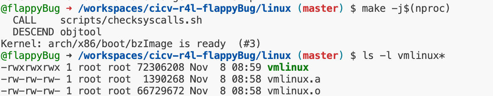
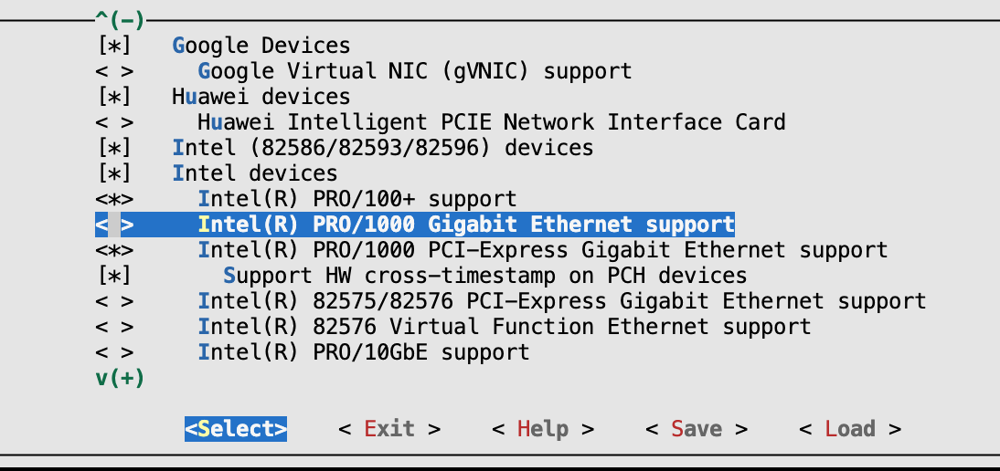
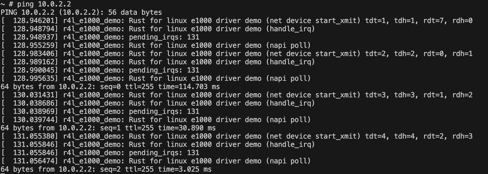
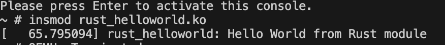
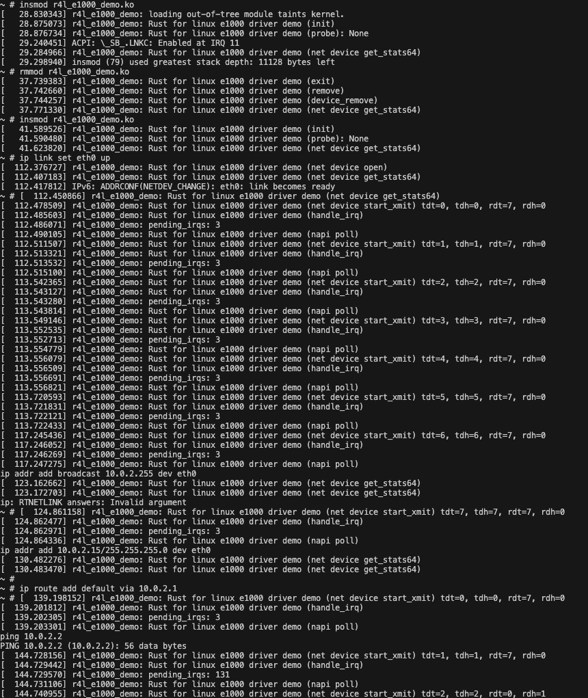
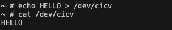

## 作业1：编译Linux内核
### 步骤
在linux文件夹下，
```
export LLVM=1
make x86_64_defconfig
make menuconfig # 勾选rust support
make -j$(nproc)
```


## 作业2：对Linux内核进行一些配置

### Q&A:
1. 编译成内核模块，是在哪个文件中以哪条语句定义的？
    Makefile中`$(MAKE) -C $(KDIR) M=$$PWD`
2、该模块位于独立的文件夹内，却能编译成Linux内核模块，这叫做out-of-tree module，请分析它是如何与内核代码产生联系的？
    在Makefile中，我们指定了内核源代码的位置（KDIR），并告诉make在那里查找内核的Makefile。然后，我们使用M=$$PWD来告诉内核Makefile我们的模块源代码在哪里。这样，内核的Makefile就可以编译我们的模块了。

### 步骤
在linux文件夹下
```bash
export LLVM=1
make menuconfig #取消勾选Intel devices, Intel(R) PRO/1000 Gigabit Ethernet support
make -j$(nproc)
cd ../src_e1000
./build_image.sh
```


进入qemu shell后

```sh
insmod r4l_e1000_demo.ko
ip link set eth0 up
ip addr add broadcast 10.0.2.255 dev eth0
ip addr add 10.0.2.15/255.255.255.0 dev eth0 
ip route add default via 10.0.2.1
ping 10.0.2.2
```



## 作业3：使用rust编写一个简单的内核模块并运行

### 步骤
1. 将rust_helloworld.rs源码粘贴到linux/samples/rust下。在pr_info!输出内容的结尾加上换行符，否则可能无法及时输出。
2. 修改linux/samples/rust/Kconfig，添加内容：
```
config SAMPLE_RUST_HELLOWORLD
	tristate "Print Helloworld in Rust"
	help
	  This option builds the hello world example for Rust.

	  If unsure, say N.
```
3. 修改linux/samples/rust/Makefile，添加内容：
```
obj-$(CONFIG_SAMPLE_RUST_HELLOWORLD)	+= rust_helloworld.o
```

4. make menuconfig，添加编译rust samples中的hello world程序。
5. make -j$(nproc)编译内核
6. 将linux/samples/rust/rust_helloworld.ko复制到 src_e1000/rootfs
7. 进入到src_e1000, `./build_image.sh`



## 作业4：为e1000网卡驱动添加remove代码

### 步骤
1. 在不做任何修改的情况下测试rmmod 后insmod，发现报错，提示reserve memory失败。
2. 查看probe的代码，怀疑是`dev.request_selected_regions(bars, c_str!("e1000 reserved memory"))?;`报错。查看`e1000_main.c:e1000_probe`和`e1000_main.c:e1000_remove`的代码，从命名上感觉`pci_release_selected_regions`应该是和`request_selected_regions`互逆的操作。
3. `pci_release_selected_regions`需要pdev。靠现有的函数签名貌似无法拿到pdev。修改`pci::Driver` trait和`remove_callback`，使之调用的时候传入pdev。
4. 重新编译内核，然后./build_image.sh。测试后发现可正常运行。
5. 当然相对于C的版本还有一大堆善后工作没做，不过能跑了，就这样吧:)



## 作业5：注册字符设备

### Q&A:
1. 作业5中的字符设备/dev/cicv是怎么创建的？它的设备号是多少？它是如何与我们写的字符设备驱动关联上的？
	在build_image.sh中，往/etc/init.d/rcS输出了`mknod /dev/cicv c 248 0`。248是主设备号，0是次设备号。在rust_chrdev.rs中，我们在module!宏指定模块名为"cicv"，这样就与我们写的字符设备驱动关联上了。

### 步骤
1. make menuconfig，将rust samples中的字符设备驱动编译进内核。
2. 修改rust_chrdev.rs，将module!宏中的模块名改为"cicv"，并实现file::Operations trait。
3. make -j$(nproc)编译内核
4. ./build_image.sh后进行测试



